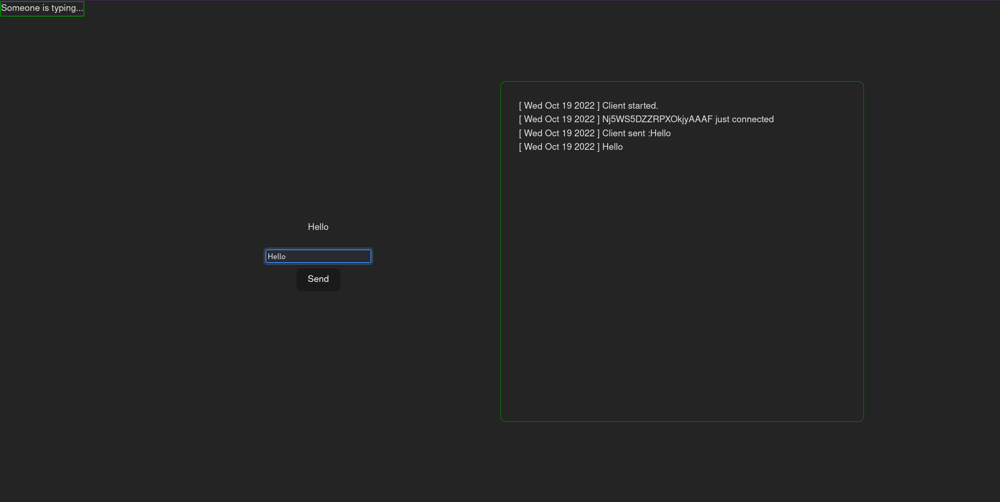

# Nest JS demo on  Socket.io & Worker thread

Here we have two apps
## 1. Front end
Front end is a basic Svelte app. It is just to demonstrate client side implementation of Socket.io.
This can send message, and depending on the focus state of the input, it emits events to let server know and broadcast if a user is typing or not.



To run the svelte app only
```bash
cd chat-client
npm install
npm run dev ## for development

## you will get the URL to localhost endpoint here...
```

## 2. Back end

This is a bare bone app, If you know how NestJs is to be run, You'll probably skip it. But you're still reading so 
```bash
cd chat-server
npm install
npm run start:dev ## for development
## You'll get the URL to API endpoint here...
```

### Socket.io

For socket implementation, nestjs provides decorators. Refer the [gateway documentation](https://docs.nestjs.com/websockets/gateways)

 ( I hope you know basics of how to make a basic Nodejs socket app because I'm not teaching you socket.io, WebSockets or events )

```typescript
@WebSocketGateway()
export class AppGateway implements OnGatewayConnection, OnGatewayDisconnect {
  @WebSocketServer()
  server: Server;

  async handleConnection(client: any, ...args: any[]) {
    Logger.verbose('Client connected', 'Client');
    Logger.verbose('Client Socket ID :' + client.id, 'Client');
  }
  async handleDisconnect(client: any) {
    Logger.verbose('Client disconnected', 'Client');
    Logger.verbose('Client Socket ID :' + client.id, 'Client');
  }

  @SubscribeMessage('event.send')
  listenMessages(@MessageBody() message: string, @ConnectedSocket() client) {
    Logger.verbose('Recieved message:' + message, 'Client');
    this.server.sockets.emit('event.recieved', message);
  }
```

The above code is simple thanks to the inbuilt functions that we override with our custom logic. Its same as the following. Just much more cleaner and won't cause confusion as to whether it's custom event or the built in one.

```typescript
io.on("connection", (socket) => {
// Other listeners...
```
Similarly there's one for disconnect too.

Make sure to register your gateway as one of the provider for the module or it won't work.

### Workers

You usually don't need workers if all that's to be done is insert and updates of single column or other IO bound operations. Since NodeJs is quite good with those type of events by default. We need workers usually when we are doing some intensive CPU bound tasks and don't want our API to be too busy and reject or keep clients waiting.


It has a sub-directory called workers in it. Which is just a [NestJs stand-alone application](https://docs.nestjs.com/standalone-applications) with `AppModule` as context. So it has access to all the repositories and resources that the entire Application has access to.

You have to give `worker.js` path and not `worker.ts` because you can't run typescript. So it's mapped to
` ./dist/workers/worker.js`.

there are two API routes
both are listed in
[http://localhost:3000/](http://localhost:3000/)

```typescript
getHello(): string {
    Logger.verbose('Triggering worker job', 'AppService');
    const worker: Worker = new Worker(`${__dirname}/workers/worker.js`);
    worker.on('message', (data) => {
      Logger.verbose(`data:${data}`, 'AppService');
      Logger.verbose('Worker is done', 'AppService');
    });
```

The implementation is similar to how your do it with NodeJs for the rest of the part. This will invoke the `worker.js` which is a [standalone nestjs app](https://docs.nestjs.com/standalone-applications)
```typescript
import { Logger } from '@nestjs/common';
import { NestFactory } from '@nestjs/core';
import { AppModule } from 'src/app.module';
import { AppService } from 'src/app.service';
import { parentPort } from 'worker_threads';

async function workerTask() {
  const app = await NestFactory.createApplicationContext(AppModule);
  const appService = app.select(AppModule).get(AppService);
  Logger.verbose('Executing...', 'Worker');
  const result = appService.intensiveTask();
  Logger.verbose('Done', 'Worker');
  parentPort.postMessage(result);
}

workerTask();
```

The CPU intensive task is... it's a demo so...

```typescript
  intensiveTask(): number {
    let p = 0;
    for (let i = 0; i < 10000000000; i++) { 
// increase if your system is fast
      p = p + i;
    }
    return p;
  }
```

Wish you good luck. I made this simply for learning purposes where I can learn 3 things at once.
1. WebSockets in NestJs
2. Workers in NestJs
3. Markdown Syntax to write this `README.md` file. [( I learned using this )](https://github.com/adam-p/markdown-here/wiki/Markdown-Cheatsheet#links)
